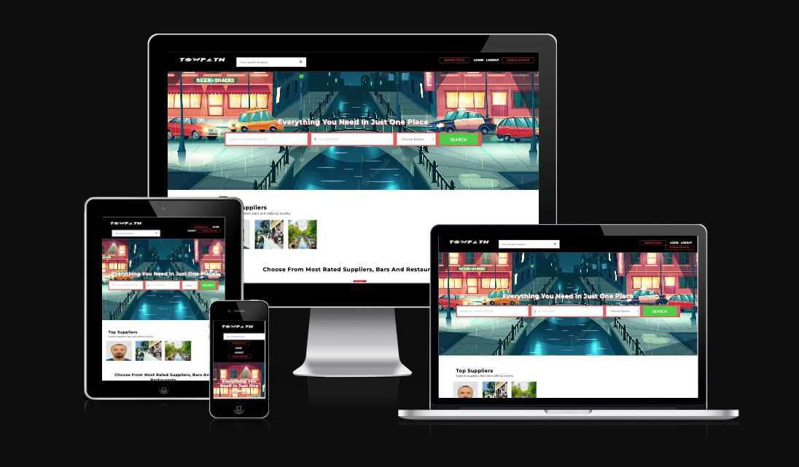

<h1 align="center">Towpath Webapp</h1>

[View the live project here.](https://towpathwebapp.boats/) 

 ### Rationale for the development of the project

Towpath Webapp is an application using Django/SQL for London canal boating communities to assist with daily boat living and upkeep. Based on my own experience living on a boat in London, I realised there is a great need for a product such as this.  Living on a boat requires knowing about services such as fuel points, repair services, and water access.  Currently, this information is scattered online in boating community Q&A sections or forums.  To access information ranging from general boating news to enquiries regarding plumbing, electrical and mechanical issues, one must go through a Facebook group, research on Google or read up on official channels like Canal & River Trust to find day-to-day services.  This includes whether particular water or toileting points are currently functioning.

<h2 align="center"></h2>

### DATABASE

1. PostgreSql

- Lucid which was used to create the database models diagram. [view](marketplace/static/img/lighthouse_testing/towpath_flowchart.jpeg)

-   ### Design
    -   #### Colour Scheme
        -   The main colours used are red gray white and balck and are proveided by bootstrap. Those colors provide a more elegant look to the website.
    -   #### Typography
        -    I used the default bootstrap font-family Roboto. The font is used throughout the whole website with Sans Serif as the fallback font in case for any reason the font isn't being imported into the site correctly. I think this font is a clean and it is used frequently in programming, so it is both attractive and appropriate.
    -   #### Imagery
        -   Imagery is important. I used imgages(free lincence on unsplash) and I used photoshop to make them web-friendly(resizing).

## Goals and Target audience

### Project goals

- The applications will provide a platform where anyone can buy an item as well as a multivendor shop.

### User Goals

- Find information about what Towpath Webapp is all about.
- Find information about how to use Towpath Webapp.
- Easily register and buy items or as vendor sell item on their online shop.
- View their items.

### Site owners goals

- Marketplace allows users to find all they need around them usign filter by current location. 
- Towpath mission: Make boater's life easier. 
- As vendor you can be easy founded. 

## Target audience

- The application will be able to be usable by all ages.
Those looking for an application buy items or sell

## User experiance (UX)

- During project planning, it was set out that the user interface should be easily understood to provide an overall good user experience and provide a positive feeling when navigating and interacting with the application.
As the application is aimed at all ages, logical placement of buttons and understandable form fields will all be clearly tagged to ensure no barriers are present or experienced whilst using the application.

### User stories

## First time user

- As a first-time user, I want to understand what the applications purpose is so that I can decide if it meets my needs. [view](#)
- As a first-time user, I want to be able to easily navigate to the registration page.
- As a first-time user, I want to find out how to add an item to the dashboard.
- As a first-time user, I want to view my items.
- As a first-time user, I want to find out more information about an item I have added.
- As a first-time user, I want to find out how to remove an item in case I make a mistake.
- As a first-time user, I want to know how to log out of Towpath.

## Returning user/vendor
- As a returning user, I want to be able to easily navigate to the login page.
- As a returning user, I want to be able to edit an item in my shop.
- As a returning user, I want to be able to see how many items are in my shop. [view](#)

## Site owner
- As the site owner, I want visitors to find Towpath approachable and know its purpose from the outset.
- As the site owner, I want visitors to be able to easily add their or buy someoneelse items.
- As a site owner, I want to encourage give a second lfe to items unwanted.

*   ### Wireframes

    -   Wireframe - [Laptop](#)
    -   Wireframe - [Tablet](#)
    -   Wireframe - [Smartphone](#)

## Features

-   Responsive on all device sizes

-   Interactive elements

### Languages Used

-   [HTML5](https://en.wikipedia.org/wiki/HTML5)
-   [CSS3](https://en.wikipedia.org/wiki/Cascading_Style_Sheets)
-   [JAVASCRIPT](https://en.wikipedia.org/wiki/JavaScript)
-   [PYTHON](https://en.wikipedia.org/wiki/Python_(programming_language)

### Frameworks, Libraries & Programs Used

1. [Bootstrap:](#)
    - Bootstrap was used to assist with the responsiveness and styling of the website.
1. [Google Fonts:](https://fonts.google.com/)
    - Google fonts were used to import the 'Titillium Web' font into the style.css file which is used on all pages throughout the project.
1. [Font Awesome:](https://fontawesome.com/)
    - Font Awesome was used on all pages throughout the website to add icons for aesthetic and UX purposes.
1. [jQuery:](https://jquery.com/)
    - jQuery came with Bootstrap to make the navbar responsive but was also used for the smooth scroll function in JavaScript.
1. [Git](https://git-scm.com/)
    - Git was used for version control by utilizing the Gitpod terminal to commit to Git and Push to GitHub.
1. [GitHub:](https://github.com/Babalu2017/ElectricSkateboardClub)
    - GitHub is used to store the projects code after being pushed from Git.
1. [Adobe Xd:](https://www.adobe.com/uk/products/xd.html)
    - xd was used to create the wireframes during the design process.
1. [Adobe Photoshop:](https://www.adobe.com/uk/products/photoshop.html)
    - Photoshop was used to edit photos as well as to make them more web friendly (resizing_save for web legacy option).
1. [Django:](#)
    - This framework has been used to build tha web app.
1. [Postgresql:](https://www.postgresql.org/)
    - Postgresql has been used to create the database where all the data are stored.
1. [NGINX:](https://www.nginx.com/resources/glossary/nginx/)
    - NGINX is open source software for web serving, reverse proxying, caching, load balancing, media streaming, and more. It started out as a web server designed for maximum performance and stability.
1. [GUNICORN:](https://gunicorn.org/)
    - Gunicorn 'Green Unicorn' is a Python WSGI HTTP Server for UNIX. It's a pre-fork worker model..

## Testing

The W3C Markup Validator, W3C CSS Validator and JSHINT Validator Services were used to validate every page of the project to ensure there were no syntax errors in the project.

1.  HTML login in validator [view](#)
2.  HTML register user validator [view](#)
3.  HTML register_vendor validator [view](#)
4.  HTML home validator [view](#)

###  Testing

1.   The Website was tested on different browsers such as: [Chrome](towpath_webapp_main/static/broweser_testing/chrome.png), [Edge](towpath_webapp_main/static/broweser_testing/edge.png), [Safari](towpath_webapp_main/static/broweser_testing/safari.png)
    
2.   The website was viewed on a variety of devices such as:
    [ipad_air_orizontal](towpath_webapp_main/static/towpathwebapp_screenshots_devices/ipad_air_horizontial.png) [aipad_air](towpath_webapp_main/static/towpathwebapp_screenshots_devices/ipad_air.png) [aipad_mini_horizontal](towpath_webapp_main/static/towpathwebapp_screenshots_devices/ipad_mini_horizontial.png) [ipad_mini](towpath_webapp_main/static/towpathwebapp_screenshots_devices/ipad_mini.png) [iphone_12](towpath_webapp_main/static/towpathwebapp_screenshots_devices/iphone_12_pro.png) [iphone_se](towpath_webapp_main/static/towpathwebapp_screenshots_devices/iphone_se.png) [iphone_xr](towpath_webapp_main/static/towpathwebapp_screenshots_devices/iphone_xr.png) [surface_pro](towpath_webapp_main/static/towpathwebapp_screenshots_devices/surface_pro_7_horizontial.png)

3.   A large amount of testing was done to ensure that all pages were linking correctly [view](#).

4.   Friends and family members were asked to review the site and documentation to point out any bugs and/or user experience issues.

### Known Bugs/Errors

-   The app crash if users insert a wrong postcode when they list an item. Error: [list out of range]. The bug was fixed adding if statements.

### Programs and online resources
1. GitHub, was used to store committed files
2. Git and Gitpod, used in conjunction through Gitpod to commit and push files to GitHub
3. Photoshop 2022, used for editing of screenshots and saving into WebP format.
4. Colour scheme, used to create a colour palette.
5. Lighthouse, used to test performance, accessibility, best practices, and SEO within the Chrome browser.
6. Am I Responsive, used for generating the main README image.
9. Lucid which was used to create the database models diagram. [view](#)

## Deployment

### Deploying a Project to Lenode

Linode is a server hosting company.(Online Deployment)
They offer virtual private server (VPS) at budget-friendly cost which is good if you are just trying to experiment with setting up your own server, installing applications on the server, running your own website, hosting a small to medium sized web application. As your app/website grow, you can expand your plans which might make it ideal for startups, freelancers or students.

The project was deployed to Lenode using the following steps...

1. Create an account with Linode.
2. Create Linode with desired plan and configuration.
3.  generate SSH Key. [view](https://www.youtube.com/watch?v=pw7BsDbHNfY)
4. Purchase your desired domain name. [Namecheap](https://www.namecheap.com/) 
5. From the Linode sidebar, select Domains to add the domain. [view](https://www.linode.com/docs/products/networking/dns-manager/#create-and-manage-domains)
6. Add the NS Records to respective registrars. [Namecheap](https://www.namecheap.com/support/knowledgebase/article.aspx/767/10/how-to-change-dns-for-a-domain/)
7. Once we have the server up and ready, we will get the IP address of this server, and we will login to our server using SSH. ---> ssh root@SERVER_IP_ADDRESS
8. Once logged in, let’s update all the packages that are currently installed in our server. ---> sudo apt update && apt upgrade -y ---> sudo apt install python3-pip python3-dev ufw nginx
9. Create a user on this server and give him a sudo permission. Remaining steps we will be performing as a user, not as root – for security purposes. ---> adduser anyname ---> adduser anyname sudo ---> exit
10. Now ssh in to the server as foodonline user. ---> ssh anyname@SERVER_IP_ADDRES ---> sudo ufw allow ssh ---> sudo ufw enable ---> sudo apt update ---> sudo pip3 install virtualenv

### Possible Deployment Issues

1. Add allowed host, release media folder, run collectstatic and create requirements.txt from the local project.
 - ALLOWED_HOSTS = ['SERVER_IP_ADDRESS', 'localhost', '127.0.0.1']
 - Remove 'media' from .gitignore file
 - python manage.py collectstatic
 - pip freeze > requirements.txt
2. Remove GDAL from requirements.txt
3. Replace psycopg2 package with psycopg2-binary
4. Install backports.zoneinfo only if the server python version is less than 3.9
5. backports.zoneinfo==0.2.1;python_version<"3.9"
6. Add gunicorn to requirements.txt

### Setting up Git to push the code from local server to remote server

1. While you are logged in to the server via SSH, create a project directory as anyname-dir inside /home/anyname/ folder.
 - cd /home/anyname/
 - mkdir anyname-dir
 - cd anyname-dir
 - mkdir site.git
 - cd site.git
 - git init --bare
2. --bare means that our folder will have no source files, just the version control.
3. Run ls to see the files and folders inside the current directory, in our case we are inside site.git, you will see ‘hooks‘ folder
 - ls
4. Run ls to see the files and folders inside the current directory, in our case we are inside site.git, you will see ‘hooks‘ folder
 - cd hooks
5. Now, create the file ‘post-receive’ by typing:
 - sudo nano post-receive
6. Type below code inside post-receive file
 - #!/bin/sh
 - git --work-tree=/home/anyname/foodonline-dir 
 - --git-dir=/home/anyname/anyname-dir/site.git checkout -f main
7. Save post-receive file by pressing CTRL + X, Y, Enter
8. In order to execute the file, we need to set the proper permissions using: sudo chmod +x post-receive

### Local Machine

1. In our project, we have already initialized git on the root folder of our project. Now, we need to configure the remote path of our repository. Tell Git to add a remote called ‘live’:
 - git remote add live ssh://anyname@SERVER_IP_ADDRESS/home/anyname/anyname-dir/site.git
 - Now, whenever we make changes in the local project and want to push the changes to live server, we simply run this command
 - git add -A
 - git commit -m "new changes to go live"
 - git push live main or master
 - Now check the remote directory, our project is pushed to the server. That’s all, we have set up Git to push the code from local machine to remote server.

### Install & Configure PostgreSQL

1. Install
 - While you are logged into the server, run following commands to install, start, enable and see the status of postgresql database:
 - sudo apt-get install postgresql postgresql-contrib
 - sudo systemctl start postgresql.service
 - sudo systemctl enable postgresql.service
 - sudo systemctl status postgresql.service
1. Configure
 - Set new password for default postgres user
 - sudo passwd postgres
 - sudo su - postgres
 - If you want to reset postgres user’s password, run the following command: ---> psql -d postgres -c "ALTER USER postgres WITH PASSWORD 'NEW PASSWORD';"
 - Login to postgres shell: ---> psql postgres
1. Create new database
 - CREATE DATABASE anyname_db;
 - exit
 - exit

### Setup Virtual Environment, configure .env file and run the server

1. In the anyname-dir folder, create virtual environment and activate it
virtualenv env
 - source env/bin/activate

2. Create .env file and provide all the required secret information
 - sudo nano .env

3. Optionally, refresh the virtual environement by running deactivate:
 - source env/bin/activate

4. Install the packages from requirements.txt file
 - pip install -r requirements.txt

5. Run makemigrations and migrate commands
 - python manage.py migrate

6. You will probably get GDAL and PostGis error as they are necessary to run our project

### Install GDAL library and PostGis extension on live server

1. Run the GDAL path configuration in settings.py only when the site is on windows local server.
 - if DEBUG == True:
     GDAL PATH CONFIGURATION
     [Install GDAL Library](https://mothergeo-py.readthedocs.io/en/latest/development/how-to/gdal-ubuntu-pkg.html)
     [Install PostGis](https://computingforgeeks.com/how-to-install-postgis-on-ubuntu-linux/)
    - Allow port 8000
    - sudo ufw allow 8000
    - Check status of ufw
    - sudo ufw status
    - Run the server: python manage.py runserver 0.0.0.0:8000

### Backup data from local machine and restore in to live database

1. Local machine.
 - python3 manage.py dumpdata > backup.json
 - Comment out post_save signal post_save_create_profile_receiver() function to prevent creating a UserProfile which essentially throws “IntegrityError 
 - duplicate key value violates unique constraint” error
 - git add -A
 - git commit -m "database backup"
 - git push live main or master
1. Remote server.
 - python3 manage.py shell
 - from django.contrib.contenttypes.models import ContentType 
 - ContentType.objects.all().delete()
 - quit()
 - python manage.py loaddata backup.json
1. Once the loaddata is successful, go to local project and uncomment post_save_create_profile_receiver() function and then push the code to live.

### Configuring Gunicorn

1. Install Gunicorn on our server
 - sudo apt install gunicorn
 - Tell gunicorn to bind to our Django application and start running gunicorn --bind 0.0.0.0:8000 foodOnline_main.wsgi
 - Test the link and make sure the site is working
 - exit
 - Go to this location and paste below code: sudo nano /etc/systemd/system/gunicorn.socket:
    [Unit]
    Description=gunicorn daemon
    Requires=gunicorn.socket
    After=network.target

    [Service]
    User=ayname
    Group=www-data
    WorkingDirectory=/home/ayname/ayname-dir
    ExecStart=/home/ayname/ayname-dir/env/bin/gunicorn 
            --access-logfile - 
            --workers 3 
            --bind unix:/run/gunicorn.sock 
            anyname_main.wsgi:application

    [Install]
    WantedBy=multi-user.target

1. Restart and enable Gunicorn socket
1. sudo systemctl start gunicorn.socket
1. sudo systemctl enable gunicorn.socket 

### Configuring Nginx as a reverse proxy

1. Location: sudo nano /etc/nginx/sites-available/anyname
  server {
    listen 80;
    server_name djangofoodonline.com www.djangofoodonline.com;

    location ~ ^/.well-known {
        root /home/foodonline/foodonline-dir;
        allow all;
    }
    location = /favicon.ico { access_log off; log_not_found off; }
    location /static/ {
        root /home/foodonline/foodonline-dir;
    }
    location /media/ {
        root /home/foodonline/foodonline-dir;
    }
    location / {
        include proxy_params;
        proxy_pass http://unix:/run/gunicorn.sock;
    }
}

1. sudo ln -s /etc/nginx/sites-available/foodonline /etc/nginx/sites-enabled/
1. sudo systemctl restart nginx

1. Open port 80 and close 8000
 - sudo ufw allow 80
 - sudo ufw allow 'Nginx Full'
 - sudo ufw allow 586
 - sudo ufw deny 8000

Go to sites-enabled directory and delete the default site
cd /etc/nginx/sites-enabled/
ls
sudo rm default

### Install SSL
 - sudo apt install certbot python3-certbot-nginx
 - Verify certbot installation by running which certbot
 - sudo certbot --nginx -d yourwebsitename.com

## Credits

### Code

- stack overflow count() method used across the site to tally movies and media types.
- stack overflow for general coding queries.
- YouTube Tutorial (error handling) was used to understand error handling.
- Rathan Kumar  | Django Custom User Model | AbstractBaseUser | AbstractUser | BaseUserManager | Real World Project | multivendor application [view](https://www.youtube.com/watch?v=NpJKB2b5fl0)
- techTFQ How to install PostgreSQL on Mac OS | Install and Uninstall PostgreSQL Database [view](https://www.youtube.com/watch?v=1aybOgni7lI)

### Content

-   All content was written by the developer.

-   Psychological properties of colours text in the README.md was found [here](http://www.colour-affects.co.uk/psychological-properties-of-colours)

### Media

-   All Images were downloaded from [Unsplash](https://unsplash.com).

### Acknowledgements

-   My collegues at Harlow College.